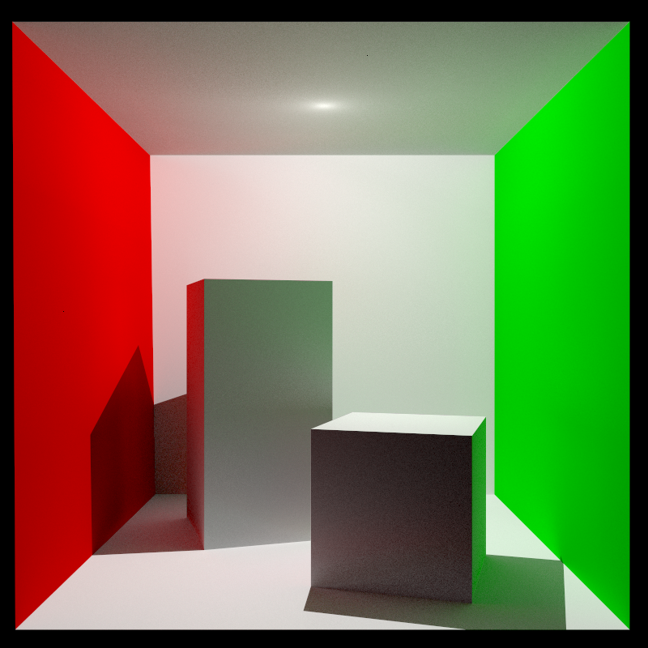
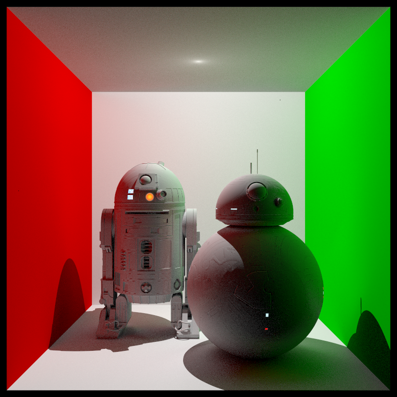
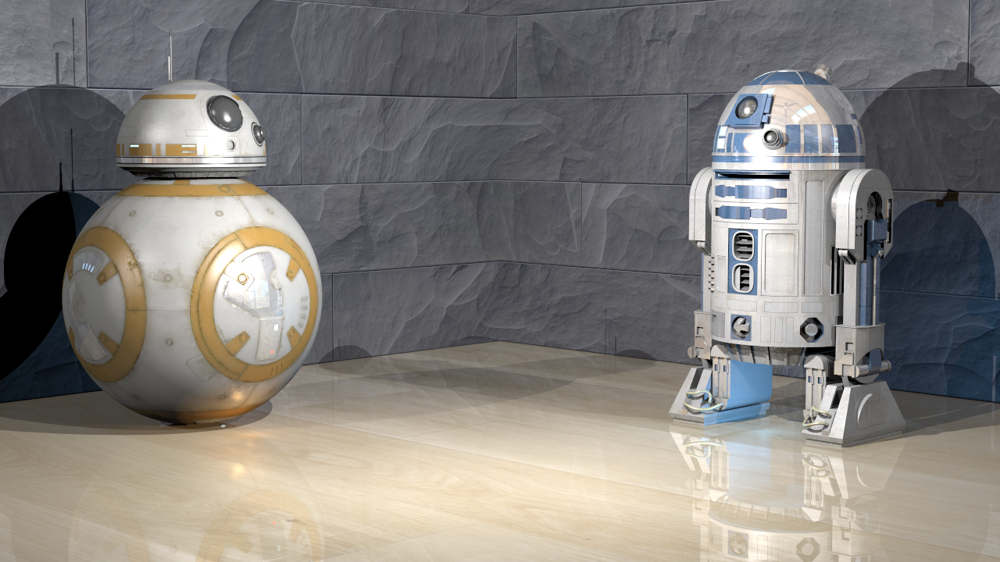

# Path tracer written in C++

A simple rendering engine written in C++ that implements _Monte Carlo Path Tracing_ technique.

## Compatibility

Tested on linux ( ubuntu ) and mac osx.

## Requirements ( linux )

Before building the project make sure you install OpenGL dev suite.

`sudo apt-get install libglu1-mesa-dev freeglut3-dev mesa-common-dev`

## Building

From the root of the project, type this commands in order to build it.

`mkdir build && cd build`

`cmake ..`

`make`

## Usage

From the building folder launch the program with the path of a scene for render it.

`./path_tracer ../scenes/SCENE_NAME`

The program outputs its render in the building folder as `rendering.png`

## Credits

Special thanks to:

- [Assimp](https://github.com/assimp/assimp) for the models importer
- [SOIL2](https://github.com/alelievr/SOIL2) for the images importer
- [Video Copilot](https://www.videocopilot.net) for some 3D models that I make use of

## Some sample renders

#### Cornell Box

#### Star Wars Cornell Box

#### Star Wars R2D2 and BB8 scene

